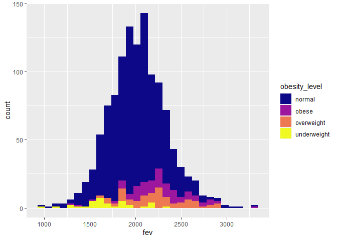

```r
library(data.table)
```

```
## Warning: package 'data.table' was built under R version 4.0.5
```

```r
library(dplyr)
```

```
## Warning: package 'dplyr' was built under R version 4.0.5
```

```
## 
## Attaching package: 'dplyr'
```

```
## The following objects are masked from 'package:data.table':
## 
##     between, first, last
```

```
## The following objects are masked from 'package:stats':
## 
##     filter, lag
```

```
## The following objects are masked from 'package:base':
## 
##     intersect, setdiff, setequal, union
```

```r
library(dtplyr)
```

```
## Warning: package 'dtplyr' was built under R version 4.0.5
```

```r
library(tidyverse)
```

```
## Warning: package 'tidyverse' was built under R version 4.0.5
```

```
## -- Attaching packages --------------------------------------- tidyverse 1.3.1 --
```

```
## v ggplot2 3.3.5     v purrr   0.3.4
## v tibble  3.1.4     v stringr 1.4.0
## v tidyr   1.1.3     v forcats 0.5.1
## v readr   2.0.1
```

```
## Warning: package 'ggplot2' was built under R version 4.0.5
```

```
## Warning: package 'tibble' was built under R version 4.0.5
```

```
## Warning: package 'tidyr' was built under R version 4.0.5
```

```
## Warning: package 'readr' was built under R version 4.0.5
```

```
## Warning: package 'purrr' was built under R version 4.0.3
```

```
## Warning: package 'stringr' was built under R version 4.0.5
```

```
## Warning: package 'forcats' was built under R version 4.0.5
```

```
## -- Conflicts ------------------------------------------ tidyverse_conflicts() --
## x dplyr::between()   masks data.table::between()
## x dplyr::filter()    masks stats::filter()
## x dplyr::first()     masks data.table::first()
## x dplyr::lag()       masks stats::lag()
## x dplyr::last()      masks data.table::last()
## x purrr::transpose() masks data.table::transpose()
```

```r
library(ggplot2)
library(leaflet)
```

```
## Warning: package 'leaflet' was built under R version 4.0.5
```


## Data Wrangling

```r
individual<-fread("chs_individual.csv")
regional<-fread("chs_regional.csv")
```


```r
total<-merge(x=individual,y=regional,by="townname",all.x = TRUE,all.y = FALSE)
```
Checking if there is any duplication.

```r
nrow(regional)
```

```
## [1] 12
```

```r
nrow(individual)
```

```
## [1] 1200
```

```r
nrow(total)<nrow(regional)+nrow(individual)
```

```
## [1] TRUE
```
Find those variables with NAs'.

```r
names(which(colSums(is.na(total)) > 0))
```

```
##  [1] "agepft"        "height"        "weight"        "bmi"          
##  [5] "asthma"        "father_asthma" "mother_asthma" "wheeze"       
##  [9] "hayfever"      "allergy"       "educ_parent"   "smoke"        
## [13] "gasstove"      "fev"           "fvc"           "mmef"         
## [17] "no_24hr"       "pm2_5_fr"
```

```r
class(total$height)="double"
```

We only need to compute the NA's of these numeric variables, while meaningless to input the NA's of dichotomous variables 

```r
total[, agepft := fcoalesce(agepft, mean(agepft, na.rm = TRUE)), by = .(male, hispanic)]
total[, height := fcoalesce(height, mean(height, na.rm = TRUE)), by = .(male, hispanic)]
total[, bmi := fcoalesce(bmi, mean(bmi, na.rm = TRUE)), by = .(male, hispanic)]
total[, fev := fcoalesce(fev, mean(fev, na.rm = TRUE)), by = .(male, hispanic)]
total[, fvc := fcoalesce(fvc, mean(fvc, na.rm = TRUE)), by = .(male, hispanic)]
total[, mmef := fcoalesce(mmef, mean(mmef, na.rm = TRUE)), by = .(male, hispanic)]
total[, no_24hr := fcoalesce(no_24hr, mean(no_24hr, na.rm = TRUE)), by = .(male, hispanic)]
total[, pm2_5_fr := fcoalesce(pm2_5_fr, mean(pm2_5_fr, na.rm = TRUE)), by = .(male, hispanic)]
```
## 2. Create a new categorical variable named “obesity_level”

```r
total[,obesity_level:=fifelse(bmi<14,"underweight",
                       fifelse(bmi<22,"normal",
                        fifelse(bmi<24,"overweight",
                               "obese")))]
table(total$obesity_level,useNA = "always")
```

```
## 
##      normal       obese  overweight underweight        <NA> 
##         975         103          87          35           0
```

```r
table<-total[,.(maximum=max(bmi),minimum=min(bmi),total_no=.N), by=obesity_level]
knitr::kable(table)
```


|obesity_level |  maximum|  minimum| total_no|
|:-------------|--------:|--------:|--------:|
|normal        | 21.96387| 14.00380|      975|
|overweight    | 23.99650| 22.02353|       87|
|obese         | 41.26613| 24.00647|      103|
|underweight   | 13.98601| 11.29640|       35|
## 3. Create another categorical variable named “smoke_gas_exposure” 

```r
smoke_gas<-total[,smoke_gas_exposure:=fifelse(smoke==0 & gasstove==0,"no_exposure",
                                   fifelse(smoke==0 & gasstove==1,"only_gas",
                                           fifelse(smoke==1 & gasstove==0, "only_smoke",
                                                   "both")))]
table(total$smoke_gas)
```

```
## 
##        both no_exposure    only_gas  only_smoke 
##         151         214         739          36
```
## 4. Create four summary tables showing the average 

```r
table_townname <- total[, .(
  fev_mean    = mean(fev,na.rm = TRUE),
  fev_sd     = sd(fev,na.rm = TRUE),
  asthma_mean = mean(asthma,na.rm = TRUE),
  asthma_sd = sd(asthma,na.rm = TRUE)
), by = townname]
knitr::kable(table_townname)
```


|townname      | fev_mean|   fev_sd| asthma_mean| asthma_sd|
|:-------------|--------:|--------:|-----------:|---------:|
|Alpine        | 2087.101| 291.1768|   0.1134021| 0.3187308|
|Atascadero    | 2075.897| 324.0935|   0.2551020| 0.4381598|
|Lake Elsinore | 2038.849| 303.6956|   0.1263158| 0.3339673|
|Lake Gregory  | 2084.700| 319.9593|   0.1515152| 0.3603750|
|Lancaster     | 2003.044| 317.1298|   0.1649485| 0.3730620|
|Lompoc        | 2034.354| 351.0454|   0.1134021| 0.3187308|
|Long Beach    | 1985.861| 319.4625|   0.1354167| 0.3439642|
|Mira Loma     | 1985.202| 324.9634|   0.1578947| 0.3665767|
|Riverside     | 1989.881| 277.5065|   0.1100000| 0.3144660|
|San Dimas     | 2026.794| 318.7845|   0.1717172| 0.3790537|
|Santa Maria   | 2025.750| 312.1725|   0.1340206| 0.3424442|
|Upland        | 2024.266| 343.1637|   0.1212121| 0.3280346|


```r
table_sex <- total[, .(
  fev_mean    = mean(fev,na.rm = TRUE),
  fev_sd     = sd(fev,na.rm = TRUE),
  asthma_mean = mean(asthma,na.rm = TRUE),
  asthma_sd = sd(asthma,na.rm = TRUE)
), by = male]
knitr::kable(table_sex)
```


| male| fev_mean|   fev_sd| asthma_mean| asthma_sd|
|----:|--------:|--------:|-----------:|---------:|
|    0| 1958.911| 311.9181|   0.1208054| 0.3261747|
|    1| 2103.787| 307.5123|   0.1727749| 0.3783828|


```r
table_obesity <- total[, .(
  fev_mean    = mean(fev,na.rm = TRUE),
  fev_sd     = sd(fev,na.rm = TRUE),
  asthma_mean = mean(asthma,na.rm = TRUE),
  asthma_sd = sd(asthma,na.rm = TRUE)
), by = obesity_level]
knitr::kable(table_obesity)
```


|obesity_level | fev_mean|   fev_sd| asthma_mean| asthma_sd|
|:-------------|--------:|--------:|-----------:|---------:|
|normal        | 1999.794| 295.1964|   0.1401475| 0.3473231|
|overweight    | 2224.322| 317.4261|   0.1647059| 0.3731162|
|obese         | 2266.154| 325.4710|   0.2100000| 0.4093602|
|underweight   | 1698.327| 303.3983|   0.0857143| 0.2840286|


```r
table_sme <- total[, .(
  fev_mean    = mean(fev,na.rm = TRUE),
  fev_sd     = sd(fev,na.rm = TRUE),
  asthma_mean = mean(asthma,na.rm = TRUE),
  asthma_sd = sd(asthma,na.rm = TRUE)
), by = smoke_gas_exposure]
knitr::kable(table_sme)
```


|smoke_gas_exposure | fev_mean|   fev_sd| asthma_mean| asthma_sd|
|:------------------|--------:|--------:|-----------:|---------:|
|no_exposure        | 2055.356| 330.4169|   0.1476190| 0.3555696|
|NA                 | 2001.878| 340.2592|   0.1489362| 0.3598746|
|only_smoke         | 2055.714| 295.6475|   0.1714286| 0.3823853|
|only_gas           | 2025.989| 317.6305|   0.1477428| 0.3550878|
|both               | 2019.867| 298.9728|   0.1301370| 0.3376123|
## Looking at the Data (EDA)

## 1.Facet plot showing scatterplots with regression lines of BMI vs FEV by “townname”.

```r
total[!is.na(bmi) & !is.na(fev)] %>% 
  ggplot() + 
  geom_point(mapping = aes(x = bmi, y = fev, color=townname)) + 
  geom_smooth(method = lm, mapping = aes(x = bmi, y = fev))+
  facet_wrap(~ townname, nrow = 3)
```

```
## `geom_smooth()` using formula 'y ~ x'
```

<!-- -->
fev gets larger as bmi increases at every location.


## 2. Stacked histograms of FEV by BMI category and FEV by smoke/gas exposure. Use different color schemes than the ggplot default.

```r
total[!is.na(fev) & !is.na(obesity_level)] %>%
  ggplot() + 
  geom_histogram(mapping = aes(x = fev, fill = obesity_level))+
  scale_fill_viridis_d(option = "plasma")
```

```
## `stat_bin()` using `bins = 30`. Pick better value with `binwidth`.
```

<!-- -->
The distribution is basically normal, while underweight population has relatively lower fev, normal obesity population has medium fev and overweighted population has relatively larger fev. In conclusion, people with higher obesity level tend to have larger fev.

```r
total[!is.na(fev) & !is.na(smoke_gas_exposure)] %>%
  ggplot() + 
  geom_histogram(mapping = aes(x = fev, fill = smoke_gas_exposure))+
  scale_fill_viridis_d(option="magma")
```

```
## `stat_bin()` using `bins = 30`. Pick better value with `binwidth`.
```

<!-- -->
The distribution is normal, but no other relation can be interpreted between smoke gas exposure and fev.

## 3. Barchart of BMI by smoke/gas exposure.

```r
total[!is.na(bmi)&!is.na(smoke_gas_exposure)] %>%
  ggplot() + 
  geom_bar(mapping = aes(x = obesity_level, colour = smoke_gas_exposure, fill=smoke_gas_exposure))+
  scale_fill_viridis_d(option="mako")
```

<!-- -->
People with only gas exposure have the largest proportion, while population with normal obesity level have a relatively large proportion of no exposure compare with the other three obesity levels.
## 4. Statistical summary graphs of FEV by BMI and FEV by smoke/gas exposure category.

```r
total[!is.na(fev)] %>%
  ggplot() + 
    stat_summary(mapping = aes(x = obesity_level, y = fev),
    fun.min = min,
    fun.max = max,
    fun = median)+
  labs(title = "statistical summary of FEV by BMI category")
```

<!-- -->
Again, fev gets larger as obesity level increases.


```r
total[!is.na(fev)& !is.na(smoke_gas_exposure)] %>%
  ggplot() + 
    stat_summary(mapping = aes(x = smoke_gas_exposure, y = fev),
    fun.min = min,
    fun.max = max,
    fun = median)+
  labs(title = "statistical summary of FEV by smoke gas exposure")
```

<!-- -->
Not quite an association between smoke gas exposure and fev.

## 5. A leaflet map showing the concentrations of PM2.5 mass in each of the CHS communities.

```r
pal <- colorFactor(c("red","blue"), domain = total$pm25_mass)
leaflet() %>% 
  addProviderTiles('CartoDB.Positron') %>% 
  addCircles(
    data = total,
    lat = ~lat, lng = ~lon, 
    opacity = 1, fillOpacity = 1, radius = 400, color = ~pal(total$pm25_mass)
    ) %>%
  addLegend('bottomleft', pal=pal, values=total$pm25_mass,
          title='PM2.5 Concentration', opacity=1)
```

```{=html}
<div id="htmlwidget-e18780d887336f992c09" style="width:672px;height:480px;" class="leaflet html-widget"></div>
<script type="application/json" data-for="htmlwidget-e18780d887336f992c09">{"x":{"options":{"crs":{"crsClass":"L.CRS.EPSG3857","code":null,"proj4def":null,"projectedBounds":null,"options":{}}},"calls":[{"method":"addProviderTiles","args":["CartoDB.Positron",null,null,{"errorTileUrl":"","noWrap":false,"detectRetina":false}]},{"method":"addCircles","args":[[32.8350521,32.8350521,32.8350521,32.8350521,32.8350521,32.8350521,32.8350521,32.8350521,32.8350521,32.8350521,32.8350521,32.8350521,32.8350521,32.8350521,32.8350521,32.8350521,32.8350521,32.8350521,32.8350521,32.8350521,32.8350521,32.8350521,32.8350521,32.8350521,32.8350521,32.8350521,32.8350521,32.8350521,32.8350521,32.8350521,32.8350521,32.8350521,32.8350521,32.8350521,32.8350521,32.8350521,32.8350521,32.8350521,32.8350521,32.8350521,32.8350521,32.8350521,32.8350521,32.8350521,32.8350521,32.8350521,32.8350521,32.8350521,32.8350521,32.8350521,32.8350521,32.8350521,32.8350521,32.8350521,32.8350521,32.8350521,32.8350521,32.8350521,32.8350521,32.8350521,32.8350521,32.8350521,32.8350521,32.8350521,32.8350521,32.8350521,32.8350521,32.8350521,32.8350521,32.8350521,32.8350521,32.8350521,32.8350521,32.8350521,32.8350521,32.8350521,32.8350521,32.8350521,32.8350521,32.8350521,32.8350521,32.8350521,32.8350521,32.8350521,32.8350521,32.8350521,32.8350521,32.8350521,32.8350521,32.8350521,32.8350521,32.8350521,32.8350521,32.8350521,32.8350521,32.8350521,32.8350521,32.8350521,32.8350521,32.8350521,35.4894169,35.4894169,35.4894169,35.4894169,35.4894169,35.4894169,35.4894169,35.4894169,35.4894169,35.4894169,35.4894169,35.4894169,35.4894169,35.4894169,35.4894169,35.4894169,35.4894169,35.4894169,35.4894169,35.4894169,35.4894169,35.4894169,35.4894169,35.4894169,35.4894169,35.4894169,35.4894169,35.4894169,35.4894169,35.4894169,35.4894169,35.4894169,35.4894169,35.4894169,35.4894169,35.4894169,35.4894169,35.4894169,35.4894169,35.4894169,35.4894169,35.4894169,35.4894169,35.4894169,35.4894169,35.4894169,35.4894169,35.4894169,35.4894169,35.4894169,35.4894169,35.4894169,35.4894169,35.4894169,35.4894169,35.4894169,35.4894169,35.4894169,35.4894169,35.4894169,35.4894169,35.4894169,35.4894169,35.4894169,35.4894169,35.4894169,35.4894169,35.4894169,35.4894169,35.4894169,35.4894169,35.4894169,35.4894169,35.4894169,35.4894169,35.4894169,35.4894169,35.4894169,35.4894169,35.4894169,35.4894169,35.4894169,35.4894169,35.4894169,35.4894169,35.4894169,35.4894169,35.4894169,35.4894169,35.4894169,35.4894169,35.4894169,35.4894169,35.4894169,35.4894169,35.4894169,35.4894169,35.4894169,35.4894169,35.4894169,33.6680772,33.6680772,33.6680772,33.6680772,33.6680772,33.6680772,33.6680772,33.6680772,33.6680772,33.6680772,33.6680772,33.6680772,33.6680772,33.6680772,33.6680772,33.6680772,33.6680772,33.6680772,33.6680772,33.6680772,33.6680772,33.6680772,33.6680772,33.6680772,33.6680772,33.6680772,33.6680772,33.6680772,33.6680772,33.6680772,33.6680772,33.6680772,33.6680772,33.6680772,33.6680772,33.6680772,33.6680772,33.6680772,33.6680772,33.6680772,33.6680772,33.6680772,33.6680772,33.6680772,33.6680772,33.6680772,33.6680772,33.6680772,33.6680772,33.6680772,33.6680772,33.6680772,33.6680772,33.6680772,33.6680772,33.6680772,33.6680772,33.6680772,33.6680772,33.6680772,33.6680772,33.6680772,33.6680772,33.6680772,33.6680772,33.6680772,33.6680772,33.6680772,33.6680772,33.6680772,33.6680772,33.6680772,33.6680772,33.6680772,33.6680772,33.6680772,33.6680772,33.6680772,33.6680772,33.6680772,33.6680772,33.6680772,33.6680772,33.6680772,33.6680772,33.6680772,33.6680772,33.6680772,33.6680772,33.6680772,33.6680772,33.6680772,33.6680772,33.6680772,33.6680772,33.6680772,33.6680772,33.6680772,33.6680772,33.6680772,34.242901,34.242901,34.242901,34.242901,34.242901,34.242901,34.242901,34.242901,34.242901,34.242901,34.242901,34.242901,34.242901,34.242901,34.242901,34.242901,34.242901,34.242901,34.242901,34.242901,34.242901,34.242901,34.242901,34.242901,34.242901,34.242901,34.242901,34.242901,34.242901,34.242901,34.242901,34.242901,34.242901,34.242901,34.242901,34.242901,34.242901,34.242901,34.242901,34.242901,34.242901,34.242901,34.242901,34.242901,34.242901,34.242901,34.242901,34.242901,34.242901,34.242901,34.242901,34.242901,34.242901,34.242901,34.242901,34.242901,34.242901,34.242901,34.242901,34.242901,34.242901,34.242901,34.242901,34.242901,34.242901,34.242901,34.242901,34.242901,34.242901,34.242901,34.242901,34.242901,34.242901,34.242901,34.242901,34.242901,34.242901,34.242901,34.242901,34.242901,34.242901,34.242901,34.242901,34.242901,34.242901,34.242901,34.242901,34.242901,34.242901,34.242901,34.242901,34.242901,34.242901,34.242901,34.242901,34.242901,34.242901,34.242901,34.242901,34.242901,34.6867846,34.6867846,34.6867846,34.6867846,34.6867846,34.6867846,34.6867846,34.6867846,34.6867846,34.6867846,34.6867846,34.6867846,34.6867846,34.6867846,34.6867846,34.6867846,34.6867846,34.6867846,34.6867846,34.6867846,34.6867846,34.6867846,34.6867846,34.6867846,34.6867846,34.6867846,34.6867846,34.6867846,34.6867846,34.6867846,34.6867846,34.6867846,34.6867846,34.6867846,34.6867846,34.6867846,34.6867846,34.6867846,34.6867846,34.6867846,34.6867846,34.6867846,34.6867846,34.6867846,34.6867846,34.6867846,34.6867846,34.6867846,34.6867846,34.6867846,34.6867846,34.6867846,34.6867846,34.6867846,34.6867846,34.6867846,34.6867846,34.6867846,34.6867846,34.6867846,34.6867846,34.6867846,34.6867846,34.6867846,34.6867846,34.6867846,34.6867846,34.6867846,34.6867846,34.6867846,34.6867846,34.6867846,34.6867846,34.6867846,34.6867846,34.6867846,34.6867846,34.6867846,34.6867846,34.6867846,34.6867846,34.6867846,34.6867846,34.6867846,34.6867846,34.6867846,34.6867846,34.6867846,34.6867846,34.6867846,34.6867846,34.6867846,34.6867846,34.6867846,34.6867846,34.6867846,34.6867846,34.6867846,34.6867846,34.6867846,34.6391501,34.6391501,34.6391501,34.6391501,34.6391501,34.6391501,34.6391501,34.6391501,34.6391501,34.6391501,34.6391501,34.6391501,34.6391501,34.6391501,34.6391501,34.6391501,34.6391501,34.6391501,34.6391501,34.6391501,34.6391501,34.6391501,34.6391501,34.6391501,34.6391501,34.6391501,34.6391501,34.6391501,34.6391501,34.6391501,34.6391501,34.6391501,34.6391501,34.6391501,34.6391501,34.6391501,34.6391501,34.6391501,34.6391501,34.6391501,34.6391501,34.6391501,34.6391501,34.6391501,34.6391501,34.6391501,34.6391501,34.6391501,34.6391501,34.6391501,34.6391501,34.6391501,34.6391501,34.6391501,34.6391501,34.6391501,34.6391501,34.6391501,34.6391501,34.6391501,34.6391501,34.6391501,34.6391501,34.6391501,34.6391501,34.6391501,34.6391501,34.6391501,34.6391501,34.6391501,34.6391501,34.6391501,34.6391501,34.6391501,34.6391501,34.6391501,34.6391501,34.6391501,34.6391501,34.6391501,34.6391501,34.6391501,34.6391501,34.6391501,34.6391501,34.6391501,34.6391501,34.6391501,34.6391501,34.6391501,34.6391501,34.6391501,34.6391501,34.6391501,34.6391501,34.6391501,34.6391501,34.6391501,34.6391501,34.6391501,33.7700504,33.7700504,33.7700504,33.7700504,33.7700504,33.7700504,33.7700504,33.7700504,33.7700504,33.7700504,33.7700504,33.7700504,33.7700504,33.7700504,33.7700504,33.7700504,33.7700504,33.7700504,33.7700504,33.7700504,33.7700504,33.7700504,33.7700504,33.7700504,33.7700504,33.7700504,33.7700504,33.7700504,33.7700504,33.7700504,33.7700504,33.7700504,33.7700504,33.7700504,33.7700504,33.7700504,33.7700504,33.7700504,33.7700504,33.7700504,33.7700504,33.7700504,33.7700504,33.7700504,33.7700504,33.7700504,33.7700504,33.7700504,33.7700504,33.7700504,33.7700504,33.7700504,33.7700504,33.7700504,33.7700504,33.7700504,33.7700504,33.7700504,33.7700504,33.7700504,33.7700504,33.7700504,33.7700504,33.7700504,33.7700504,33.7700504,33.7700504,33.7700504,33.7700504,33.7700504,33.7700504,33.7700504,33.7700504,33.7700504,33.7700504,33.7700504,33.7700504,33.7700504,33.7700504,33.7700504,33.7700504,33.7700504,33.7700504,33.7700504,33.7700504,33.7700504,33.7700504,33.7700504,33.7700504,33.7700504,33.7700504,33.7700504,33.7700504,33.7700504,33.7700504,33.7700504,33.7700504,33.7700504,33.7700504,33.7700504,33.9845417,33.9845417,33.9845417,33.9845417,33.9845417,33.9845417,33.9845417,33.9845417,33.9845417,33.9845417,33.9845417,33.9845417,33.9845417,33.9845417,33.9845417,33.9845417,33.9845417,33.9845417,33.9845417,33.9845417,33.9845417,33.9845417,33.9845417,33.9845417,33.9845417,33.9845417,33.9845417,33.9845417,33.9845417,33.9845417,33.9845417,33.9845417,33.9845417,33.9845417,33.9845417,33.9845417,33.9845417,33.9845417,33.9845417,33.9845417,33.9845417,33.9845417,33.9845417,33.9845417,33.9845417,33.9845417,33.9845417,33.9845417,33.9845417,33.9845417,33.9845417,33.9845417,33.9845417,33.9845417,33.9845417,33.9845417,33.9845417,33.9845417,33.9845417,33.9845417,33.9845417,33.9845417,33.9845417,33.9845417,33.9845417,33.9845417,33.9845417,33.9845417,33.9845417,33.9845417,33.9845417,33.9845417,33.9845417,33.9845417,33.9845417,33.9845417,33.9845417,33.9845417,33.9845417,33.9845417,33.9845417,33.9845417,33.9845417,33.9845417,33.9845417,33.9845417,33.9845417,33.9845417,33.9845417,33.9845417,33.9845417,33.9845417,33.9845417,33.9845417,33.9845417,33.9845417,33.9845417,33.9845417,33.9845417,33.9845417,33.9806005,33.9806005,33.9806005,33.9806005,33.9806005,33.9806005,33.9806005,33.9806005,33.9806005,33.9806005,33.9806005,33.9806005,33.9806005,33.9806005,33.9806005,33.9806005,33.9806005,33.9806005,33.9806005,33.9806005,33.9806005,33.9806005,33.9806005,33.9806005,33.9806005,33.9806005,33.9806005,33.9806005,33.9806005,33.9806005,33.9806005,33.9806005,33.9806005,33.9806005,33.9806005,33.9806005,33.9806005,33.9806005,33.9806005,33.9806005,33.9806005,33.9806005,33.9806005,33.9806005,33.9806005,33.9806005,33.9806005,33.9806005,33.9806005,33.9806005,33.9806005,33.9806005,33.9806005,33.9806005,33.9806005,33.9806005,33.9806005,33.9806005,33.9806005,33.9806005,33.9806005,33.9806005,33.9806005,33.9806005,33.9806005,33.9806005,33.9806005,33.9806005,33.9806005,33.9806005,33.9806005,33.9806005,33.9806005,33.9806005,33.9806005,33.9806005,33.9806005,33.9806005,33.9806005,33.9806005,33.9806005,33.9806005,33.9806005,33.9806005,33.9806005,33.9806005,33.9806005,33.9806005,33.9806005,33.9806005,33.9806005,33.9806005,33.9806005,33.9806005,33.9806005,33.9806005,33.9806005,33.9806005,33.9806005,33.9806005,34.1066756,34.1066756,34.1066756,34.1066756,34.1066756,34.1066756,34.1066756,34.1066756,34.1066756,34.1066756,34.1066756,34.1066756,34.1066756,34.1066756,34.1066756,34.1066756,34.1066756,34.1066756,34.1066756,34.1066756,34.1066756,34.1066756,34.1066756,34.1066756,34.1066756,34.1066756,34.1066756,34.1066756,34.1066756,34.1066756,34.1066756,34.1066756,34.1066756,34.1066756,34.1066756,34.1066756,34.1066756,34.1066756,34.1066756,34.1066756,34.1066756,34.1066756,34.1066756,34.1066756,34.1066756,34.1066756,34.1066756,34.1066756,34.1066756,34.1066756,34.1066756,34.1066756,34.1066756,34.1066756,34.1066756,34.1066756,34.1066756,34.1066756,34.1066756,34.1066756,34.1066756,34.1066756,34.1066756,34.1066756,34.1066756,34.1066756,34.1066756,34.1066756,34.1066756,34.1066756,34.1066756,34.1066756,34.1066756,34.1066756,34.1066756,34.1066756,34.1066756,34.1066756,34.1066756,34.1066756,34.1066756,34.1066756,34.1066756,34.1066756,34.1066756,34.1066756,34.1066756,34.1066756,34.1066756,34.1066756,34.1066756,34.1066756,34.1066756,34.1066756,34.1066756,34.1066756,34.1066756,34.1066756,34.1066756,34.1066756,34.9530337,34.9530337,34.9530337,34.9530337,34.9530337,34.9530337,34.9530337,34.9530337,34.9530337,34.9530337,34.9530337,34.9530337,34.9530337,34.9530337,34.9530337,34.9530337,34.9530337,34.9530337,34.9530337,34.9530337,34.9530337,34.9530337,34.9530337,34.9530337,34.9530337,34.9530337,34.9530337,34.9530337,34.9530337,34.9530337,34.9530337,34.9530337,34.9530337,34.9530337,34.9530337,34.9530337,34.9530337,34.9530337,34.9530337,34.9530337,34.9530337,34.9530337,34.9530337,34.9530337,34.9530337,34.9530337,34.9530337,34.9530337,34.9530337,34.9530337,34.9530337,34.9530337,34.9530337,34.9530337,34.9530337,34.9530337,34.9530337,34.9530337,34.9530337,34.9530337,34.9530337,34.9530337,34.9530337,34.9530337,34.9530337,34.9530337,34.9530337,34.9530337,34.9530337,34.9530337,34.9530337,34.9530337,34.9530337,34.9530337,34.9530337,34.9530337,34.9530337,34.9530337,34.9530337,34.9530337,34.9530337,34.9530337,34.9530337,34.9530337,34.9530337,34.9530337,34.9530337,34.9530337,34.9530337,34.9530337,34.9530337,34.9530337,34.9530337,34.9530337,34.9530337,34.9530337,34.9530337,34.9530337,34.9530337,34.9530337,34.09751,34.09751,34.09751,34.09751,34.09751,34.09751,34.09751,34.09751,34.09751,34.09751,34.09751,34.09751,34.09751,34.09751,34.09751,34.09751,34.09751,34.09751,34.09751,34.09751,34.09751,34.09751,34.09751,34.09751,34.09751,34.09751,34.09751,34.09751,34.09751,34.09751,34.09751,34.09751,34.09751,34.09751,34.09751,34.09751,34.09751,34.09751,34.09751,34.09751,34.09751,34.09751,34.09751,34.09751,34.09751,34.09751,34.09751,34.09751,34.09751,34.09751,34.09751,34.09751,34.09751,34.09751,34.09751,34.09751,34.09751,34.09751,34.09751,34.09751,34.09751,34.09751,34.09751,34.09751,34.09751,34.09751,34.09751,34.09751,34.09751,34.09751,34.09751,34.09751,34.09751,34.09751,34.09751,34.09751,34.09751,34.09751,34.09751,34.09751,34.09751,34.09751,34.09751,34.09751,34.09751,34.09751,34.09751,34.09751,34.09751,34.09751,34.09751,34.09751,34.09751,34.09751,34.09751,34.09751,34.09751,34.09751,34.09751,34.09751],[-116.7664109,-116.7664109,-116.7664109,-116.7664109,-116.7664109,-116.7664109,-116.7664109,-116.7664109,-116.7664109,-116.7664109,-116.7664109,-116.7664109,-116.7664109,-116.7664109,-116.7664109,-116.7664109,-116.7664109,-116.7664109,-116.7664109,-116.7664109,-116.7664109,-116.7664109,-116.7664109,-116.7664109,-116.7664109,-116.7664109,-116.7664109,-116.7664109,-116.7664109,-116.7664109,-116.7664109,-116.7664109,-116.7664109,-116.7664109,-116.7664109,-116.7664109,-116.7664109,-116.7664109,-116.7664109,-116.7664109,-116.7664109,-116.7664109,-116.7664109,-116.7664109,-116.7664109,-116.7664109,-116.7664109,-116.7664109,-116.7664109,-116.7664109,-116.7664109,-116.7664109,-116.7664109,-116.7664109,-116.7664109,-116.7664109,-116.7664109,-116.7664109,-116.7664109,-116.7664109,-116.7664109,-116.7664109,-116.7664109,-116.7664109,-116.7664109,-116.7664109,-116.7664109,-116.7664109,-116.7664109,-116.7664109,-116.7664109,-116.7664109,-116.7664109,-116.7664109,-116.7664109,-116.7664109,-116.7664109,-116.7664109,-116.7664109,-116.7664109,-116.7664109,-116.7664109,-116.7664109,-116.7664109,-116.7664109,-116.7664109,-116.7664109,-116.7664109,-116.7664109,-116.7664109,-116.7664109,-116.7664109,-116.7664109,-116.7664109,-116.7664109,-116.7664109,-116.7664109,-116.7664109,-116.7664109,-116.7664109,-120.6707255,-120.6707255,-120.6707255,-120.6707255,-120.6707255,-120.6707255,-120.6707255,-120.6707255,-120.6707255,-120.6707255,-120.6707255,-120.6707255,-120.6707255,-120.6707255,-120.6707255,-120.6707255,-120.6707255,-120.6707255,-120.6707255,-120.6707255,-120.6707255,-120.6707255,-120.6707255,-120.6707255,-120.6707255,-120.6707255,-120.6707255,-120.6707255,-120.6707255,-120.6707255,-120.6707255,-120.6707255,-120.6707255,-120.6707255,-120.6707255,-120.6707255,-120.6707255,-120.6707255,-120.6707255,-120.6707255,-120.6707255,-120.6707255,-120.6707255,-120.6707255,-120.6707255,-120.6707255,-120.6707255,-120.6707255,-120.6707255,-120.6707255,-120.6707255,-120.6707255,-120.6707255,-120.6707255,-120.6707255,-120.6707255,-120.6707255,-120.6707255,-120.6707255,-120.6707255,-120.6707255,-120.6707255,-120.6707255,-120.6707255,-120.6707255,-120.6707255,-120.6707255,-120.6707255,-120.6707255,-120.6707255,-120.6707255,-120.6707255,-120.6707255,-120.6707255,-120.6707255,-120.6707255,-120.6707255,-120.6707255,-120.6707255,-120.6707255,-120.6707255,-120.6707255,-120.6707255,-120.6707255,-120.6707255,-120.6707255,-120.6707255,-120.6707255,-120.6707255,-120.6707255,-120.6707255,-120.6707255,-120.6707255,-120.6707255,-120.6707255,-120.6707255,-120.6707255,-120.6707255,-120.6707255,-120.6707255,-117.3272615,-117.3272615,-117.3272615,-117.3272615,-117.3272615,-117.3272615,-117.3272615,-117.3272615,-117.3272615,-117.3272615,-117.3272615,-117.3272615,-117.3272615,-117.3272615,-117.3272615,-117.3272615,-117.3272615,-117.3272615,-117.3272615,-117.3272615,-117.3272615,-117.3272615,-117.3272615,-117.3272615,-117.3272615,-117.3272615,-117.3272615,-117.3272615,-117.3272615,-117.3272615,-117.3272615,-117.3272615,-117.3272615,-117.3272615,-117.3272615,-117.3272615,-117.3272615,-117.3272615,-117.3272615,-117.3272615,-117.3272615,-117.3272615,-117.3272615,-117.3272615,-117.3272615,-117.3272615,-117.3272615,-117.3272615,-117.3272615,-117.3272615,-117.3272615,-117.3272615,-117.3272615,-117.3272615,-117.3272615,-117.3272615,-117.3272615,-117.3272615,-117.3272615,-117.3272615,-117.3272615,-117.3272615,-117.3272615,-117.3272615,-117.3272615,-117.3272615,-117.3272615,-117.3272615,-117.3272615,-117.3272615,-117.3272615,-117.3272615,-117.3272615,-117.3272615,-117.3272615,-117.3272615,-117.3272615,-117.3272615,-117.3272615,-117.3272615,-117.3272615,-117.3272615,-117.3272615,-117.3272615,-117.3272615,-117.3272615,-117.3272615,-117.3272615,-117.3272615,-117.3272615,-117.3272615,-117.3272615,-117.3272615,-117.3272615,-117.3272615,-117.3272615,-117.3272615,-117.3272615,-117.3272615,-117.3272615,-117.275233,-117.275233,-117.275233,-117.275233,-117.275233,-117.275233,-117.275233,-117.275233,-117.275233,-117.275233,-117.275233,-117.275233,-117.275233,-117.275233,-117.275233,-117.275233,-117.275233,-117.275233,-117.275233,-117.275233,-117.275233,-117.275233,-117.275233,-117.275233,-117.275233,-117.275233,-117.275233,-117.275233,-117.275233,-117.275233,-117.275233,-117.275233,-117.275233,-117.275233,-117.275233,-117.275233,-117.275233,-117.275233,-117.275233,-117.275233,-117.275233,-117.275233,-117.275233,-117.275233,-117.275233,-117.275233,-117.275233,-117.275233,-117.275233,-117.275233,-117.275233,-117.275233,-117.275233,-117.275233,-117.275233,-117.275233,-117.275233,-117.275233,-117.275233,-117.275233,-117.275233,-117.275233,-117.275233,-117.275233,-117.275233,-117.275233,-117.275233,-117.275233,-117.275233,-117.275233,-117.275233,-117.275233,-117.275233,-117.275233,-117.275233,-117.275233,-117.275233,-117.275233,-117.275233,-117.275233,-117.275233,-117.275233,-117.275233,-117.275233,-117.275233,-117.275233,-117.275233,-117.275233,-117.275233,-117.275233,-117.275233,-117.275233,-117.275233,-117.275233,-117.275233,-117.275233,-117.275233,-117.275233,-117.275233,-117.275233,-118.1541632,-118.1541632,-118.1541632,-118.1541632,-118.1541632,-118.1541632,-118.1541632,-118.1541632,-118.1541632,-118.1541632,-118.1541632,-118.1541632,-118.1541632,-118.1541632,-118.1541632,-118.1541632,-118.1541632,-118.1541632,-118.1541632,-118.1541632,-118.1541632,-118.1541632,-118.1541632,-118.1541632,-118.1541632,-118.1541632,-118.1541632,-118.1541632,-118.1541632,-118.1541632,-118.1541632,-118.1541632,-118.1541632,-118.1541632,-118.1541632,-118.1541632,-118.1541632,-118.1541632,-118.1541632,-118.1541632,-118.1541632,-118.1541632,-118.1541632,-118.1541632,-118.1541632,-118.1541632,-118.1541632,-118.1541632,-118.1541632,-118.1541632,-118.1541632,-118.1541632,-118.1541632,-118.1541632,-118.1541632,-118.1541632,-118.1541632,-118.1541632,-118.1541632,-118.1541632,-118.1541632,-118.1541632,-118.1541632,-118.1541632,-118.1541632,-118.1541632,-118.1541632,-118.1541632,-118.1541632,-118.1541632,-118.1541632,-118.1541632,-118.1541632,-118.1541632,-118.1541632,-118.1541632,-118.1541632,-118.1541632,-118.1541632,-118.1541632,-118.1541632,-118.1541632,-118.1541632,-118.1541632,-118.1541632,-118.1541632,-118.1541632,-118.1541632,-118.1541632,-118.1541632,-118.1541632,-118.1541632,-118.1541632,-118.1541632,-118.1541632,-118.1541632,-118.1541632,-118.1541632,-118.1541632,-118.1541632,-120.4579409,-120.4579409,-120.4579409,-120.4579409,-120.4579409,-120.4579409,-120.4579409,-120.4579409,-120.4579409,-120.4579409,-120.4579409,-120.4579409,-120.4579409,-120.4579409,-120.4579409,-120.4579409,-120.4579409,-120.4579409,-120.4579409,-120.4579409,-120.4579409,-120.4579409,-120.4579409,-120.4579409,-120.4579409,-120.4579409,-120.4579409,-120.4579409,-120.4579409,-120.4579409,-120.4579409,-120.4579409,-120.4579409,-120.4579409,-120.4579409,-120.4579409,-120.4579409,-120.4579409,-120.4579409,-120.4579409,-120.4579409,-120.4579409,-120.4579409,-120.4579409,-120.4579409,-120.4579409,-120.4579409,-120.4579409,-120.4579409,-120.4579409,-120.4579409,-120.4579409,-120.4579409,-120.4579409,-120.4579409,-120.4579409,-120.4579409,-120.4579409,-120.4579409,-120.4579409,-120.4579409,-120.4579409,-120.4579409,-120.4579409,-120.4579409,-120.4579409,-120.4579409,-120.4579409,-120.4579409,-120.4579409,-120.4579409,-120.4579409,-120.4579409,-120.4579409,-120.4579409,-120.4579409,-120.4579409,-120.4579409,-120.4579409,-120.4579409,-120.4579409,-120.4579409,-120.4579409,-120.4579409,-120.4579409,-120.4579409,-120.4579409,-120.4579409,-120.4579409,-120.4579409,-120.4579409,-120.4579409,-120.4579409,-120.4579409,-120.4579409,-120.4579409,-120.4579409,-120.4579409,-120.4579409,-120.4579409,-118.1937395,-118.1937395,-118.1937395,-118.1937395,-118.1937395,-118.1937395,-118.1937395,-118.1937395,-118.1937395,-118.1937395,-118.1937395,-118.1937395,-118.1937395,-118.1937395,-118.1937395,-118.1937395,-118.1937395,-118.1937395,-118.1937395,-118.1937395,-118.1937395,-118.1937395,-118.1937395,-118.1937395,-118.1937395,-118.1937395,-118.1937395,-118.1937395,-118.1937395,-118.1937395,-118.1937395,-118.1937395,-118.1937395,-118.1937395,-118.1937395,-118.1937395,-118.1937395,-118.1937395,-118.1937395,-118.1937395,-118.1937395,-118.1937395,-118.1937395,-118.1937395,-118.1937395,-118.1937395,-118.1937395,-118.1937395,-118.1937395,-118.1937395,-118.1937395,-118.1937395,-118.1937395,-118.1937395,-118.1937395,-118.1937395,-118.1937395,-118.1937395,-118.1937395,-118.1937395,-118.1937395,-118.1937395,-118.1937395,-118.1937395,-118.1937395,-118.1937395,-118.1937395,-118.1937395,-118.1937395,-118.1937395,-118.1937395,-118.1937395,-118.1937395,-118.1937395,-118.1937395,-118.1937395,-118.1937395,-118.1937395,-118.1937395,-118.1937395,-118.1937395,-118.1937395,-118.1937395,-118.1937395,-118.1937395,-118.1937395,-118.1937395,-118.1937395,-118.1937395,-118.1937395,-118.1937395,-118.1937395,-118.1937395,-118.1937395,-118.1937395,-118.1937395,-118.1937395,-118.1937395,-118.1937395,-118.1937395,-117.5159449,-117.5159449,-117.5159449,-117.5159449,-117.5159449,-117.5159449,-117.5159449,-117.5159449,-117.5159449,-117.5159449,-117.5159449,-117.5159449,-117.5159449,-117.5159449,-117.5159449,-117.5159449,-117.5159449,-117.5159449,-117.5159449,-117.5159449,-117.5159449,-117.5159449,-117.5159449,-117.5159449,-117.5159449,-117.5159449,-117.5159449,-117.5159449,-117.5159449,-117.5159449,-117.5159449,-117.5159449,-117.5159449,-117.5159449,-117.5159449,-117.5159449,-117.5159449,-117.5159449,-117.5159449,-117.5159449,-117.5159449,-117.5159449,-117.5159449,-117.5159449,-117.5159449,-117.5159449,-117.5159449,-117.5159449,-117.5159449,-117.5159449,-117.5159449,-117.5159449,-117.5159449,-117.5159449,-117.5159449,-117.5159449,-117.5159449,-117.5159449,-117.5159449,-117.5159449,-117.5159449,-117.5159449,-117.5159449,-117.5159449,-117.5159449,-117.5159449,-117.5159449,-117.5159449,-117.5159449,-117.5159449,-117.5159449,-117.5159449,-117.5159449,-117.5159449,-117.5159449,-117.5159449,-117.5159449,-117.5159449,-117.5159449,-117.5159449,-117.5159449,-117.5159449,-117.5159449,-117.5159449,-117.5159449,-117.5159449,-117.5159449,-117.5159449,-117.5159449,-117.5159449,-117.5159449,-117.5159449,-117.5159449,-117.5159449,-117.5159449,-117.5159449,-117.5159449,-117.5159449,-117.5159449,-117.5159449,-117.3754942,-117.3754942,-117.3754942,-117.3754942,-117.3754942,-117.3754942,-117.3754942,-117.3754942,-117.3754942,-117.3754942,-117.3754942,-117.3754942,-117.3754942,-117.3754942,-117.3754942,-117.3754942,-117.3754942,-117.3754942,-117.3754942,-117.3754942,-117.3754942,-117.3754942,-117.3754942,-117.3754942,-117.3754942,-117.3754942,-117.3754942,-117.3754942,-117.3754942,-117.3754942,-117.3754942,-117.3754942,-117.3754942,-117.3754942,-117.3754942,-117.3754942,-117.3754942,-117.3754942,-117.3754942,-117.3754942,-117.3754942,-117.3754942,-117.3754942,-117.3754942,-117.3754942,-117.3754942,-117.3754942,-117.3754942,-117.3754942,-117.3754942,-117.3754942,-117.3754942,-117.3754942,-117.3754942,-117.3754942,-117.3754942,-117.3754942,-117.3754942,-117.3754942,-117.3754942,-117.3754942,-117.3754942,-117.3754942,-117.3754942,-117.3754942,-117.3754942,-117.3754942,-117.3754942,-117.3754942,-117.3754942,-117.3754942,-117.3754942,-117.3754942,-117.3754942,-117.3754942,-117.3754942,-117.3754942,-117.3754942,-117.3754942,-117.3754942,-117.3754942,-117.3754942,-117.3754942,-117.3754942,-117.3754942,-117.3754942,-117.3754942,-117.3754942,-117.3754942,-117.3754942,-117.3754942,-117.3754942,-117.3754942,-117.3754942,-117.3754942,-117.3754942,-117.3754942,-117.3754942,-117.3754942,-117.3754942,-117.8067257,-117.8067257,-117.8067257,-117.8067257,-117.8067257,-117.8067257,-117.8067257,-117.8067257,-117.8067257,-117.8067257,-117.8067257,-117.8067257,-117.8067257,-117.8067257,-117.8067257,-117.8067257,-117.8067257,-117.8067257,-117.8067257,-117.8067257,-117.8067257,-117.8067257,-117.8067257,-117.8067257,-117.8067257,-117.8067257,-117.8067257,-117.8067257,-117.8067257,-117.8067257,-117.8067257,-117.8067257,-117.8067257,-117.8067257,-117.8067257,-117.8067257,-117.8067257,-117.8067257,-117.8067257,-117.8067257,-117.8067257,-117.8067257,-117.8067257,-117.8067257,-117.8067257,-117.8067257,-117.8067257,-117.8067257,-117.8067257,-117.8067257,-117.8067257,-117.8067257,-117.8067257,-117.8067257,-117.8067257,-117.8067257,-117.8067257,-117.8067257,-117.8067257,-117.8067257,-117.8067257,-117.8067257,-117.8067257,-117.8067257,-117.8067257,-117.8067257,-117.8067257,-117.8067257,-117.8067257,-117.8067257,-117.8067257,-117.8067257,-117.8067257,-117.8067257,-117.8067257,-117.8067257,-117.8067257,-117.8067257,-117.8067257,-117.8067257,-117.8067257,-117.8067257,-117.8067257,-117.8067257,-117.8067257,-117.8067257,-117.8067257,-117.8067257,-117.8067257,-117.8067257,-117.8067257,-117.8067257,-117.8067257,-117.8067257,-117.8067257,-117.8067257,-117.8067257,-117.8067257,-117.8067257,-117.8067257,-120.4357191,-120.4357191,-120.4357191,-120.4357191,-120.4357191,-120.4357191,-120.4357191,-120.4357191,-120.4357191,-120.4357191,-120.4357191,-120.4357191,-120.4357191,-120.4357191,-120.4357191,-120.4357191,-120.4357191,-120.4357191,-120.4357191,-120.4357191,-120.4357191,-120.4357191,-120.4357191,-120.4357191,-120.4357191,-120.4357191,-120.4357191,-120.4357191,-120.4357191,-120.4357191,-120.4357191,-120.4357191,-120.4357191,-120.4357191,-120.4357191,-120.4357191,-120.4357191,-120.4357191,-120.4357191,-120.4357191,-120.4357191,-120.4357191,-120.4357191,-120.4357191,-120.4357191,-120.4357191,-120.4357191,-120.4357191,-120.4357191,-120.4357191,-120.4357191,-120.4357191,-120.4357191,-120.4357191,-120.4357191,-120.4357191,-120.4357191,-120.4357191,-120.4357191,-120.4357191,-120.4357191,-120.4357191,-120.4357191,-120.4357191,-120.4357191,-120.4357191,-120.4357191,-120.4357191,-120.4357191,-120.4357191,-120.4357191,-120.4357191,-120.4357191,-120.4357191,-120.4357191,-120.4357191,-120.4357191,-120.4357191,-120.4357191,-120.4357191,-120.4357191,-120.4357191,-120.4357191,-120.4357191,-120.4357191,-120.4357191,-120.4357191,-120.4357191,-120.4357191,-120.4357191,-120.4357191,-120.4357191,-120.4357191,-120.4357191,-120.4357191,-120.4357191,-120.4357191,-120.4357191,-120.4357191,-120.4357191,-117.6483876,-117.6483876,-117.6483876,-117.6483876,-117.6483876,-117.6483876,-117.6483876,-117.6483876,-117.6483876,-117.6483876,-117.6483876,-117.6483876,-117.6483876,-117.6483876,-117.6483876,-117.6483876,-117.6483876,-117.6483876,-117.6483876,-117.6483876,-117.6483876,-117.6483876,-117.6483876,-117.6483876,-117.6483876,-117.6483876,-117.6483876,-117.6483876,-117.6483876,-117.6483876,-117.6483876,-117.6483876,-117.6483876,-117.6483876,-117.6483876,-117.6483876,-117.6483876,-117.6483876,-117.6483876,-117.6483876,-117.6483876,-117.6483876,-117.6483876,-117.6483876,-117.6483876,-117.6483876,-117.6483876,-117.6483876,-117.6483876,-117.6483876,-117.6483876,-117.6483876,-117.6483876,-117.6483876,-117.6483876,-117.6483876,-117.6483876,-117.6483876,-117.6483876,-117.6483876,-117.6483876,-117.6483876,-117.6483876,-117.6483876,-117.6483876,-117.6483876,-117.6483876,-117.6483876,-117.6483876,-117.6483876,-117.6483876,-117.6483876,-117.6483876,-117.6483876,-117.6483876,-117.6483876,-117.6483876,-117.6483876,-117.6483876,-117.6483876,-117.6483876,-117.6483876,-117.6483876,-117.6483876,-117.6483876,-117.6483876,-117.6483876,-117.6483876,-117.6483876,-117.6483876,-117.6483876,-117.6483876,-117.6483876,-117.6483876,-117.6483876,-117.6483876,-117.6483876,-117.6483876,-117.6483876,-117.6483876],400,null,null,{"interactive":true,"className":"","stroke":true,"color":["#D0007E","#D0007E","#D0007E","#D0007E","#D0007E","#D0007E","#D0007E","#D0007E","#D0007E","#D0007E","#D0007E","#D0007E","#D0007E","#D0007E","#D0007E","#D0007E","#D0007E","#D0007E","#D0007E","#D0007E","#D0007E","#D0007E","#D0007E","#D0007E","#D0007E","#D0007E","#D0007E","#D0007E","#D0007E","#D0007E","#D0007E","#D0007E","#D0007E","#D0007E","#D0007E","#D0007E","#D0007E","#D0007E","#D0007E","#D0007E","#D0007E","#D0007E","#D0007E","#D0007E","#D0007E","#D0007E","#D0007E","#D0007E","#D0007E","#D0007E","#D0007E","#D0007E","#D0007E","#D0007E","#D0007E","#D0007E","#D0007E","#D0007E","#D0007E","#D0007E","#D0007E","#D0007E","#D0007E","#D0007E","#D0007E","#D0007E","#D0007E","#D0007E","#D0007E","#D0007E","#D0007E","#D0007E","#D0007E","#D0007E","#D0007E","#D0007E","#D0007E","#D0007E","#D0007E","#D0007E","#D0007E","#D0007E","#D0007E","#D0007E","#D0007E","#D0007E","#D0007E","#D0007E","#D0007E","#D0007E","#D0007E","#D0007E","#D0007E","#D0007E","#D0007E","#D0007E","#D0007E","#D0007E","#D0007E","#D0007E","#EF003F","#EF003F","#EF003F","#EF003F","#EF003F","#EF003F","#EF003F","#EF003F","#EF003F","#EF003F","#EF003F","#EF003F","#EF003F","#EF003F","#EF003F","#EF003F","#EF003F","#EF003F","#EF003F","#EF003F","#EF003F","#EF003F","#EF003F","#EF003F","#EF003F","#EF003F","#EF003F","#EF003F","#EF003F","#EF003F","#EF003F","#EF003F","#EF003F","#EF003F","#EF003F","#EF003F","#EF003F","#EF003F","#EF003F","#EF003F","#EF003F","#EF003F","#EF003F","#EF003F","#EF003F","#EF003F","#EF003F","#EF003F","#EF003F","#EF003F","#EF003F","#EF003F","#EF003F","#EF003F","#EF003F","#EF003F","#EF003F","#EF003F","#EF003F","#EF003F","#EF003F","#EF003F","#EF003F","#EF003F","#EF003F","#EF003F","#EF003F","#EF003F","#EF003F","#EF003F","#EF003F","#EF003F","#EF003F","#EF003F","#EF003F","#EF003F","#EF003F","#EF003F","#EF003F","#EF003F","#EF003F","#EF003F","#EF003F","#EF003F","#EF003F","#EF003F","#EF003F","#EF003F","#EF003F","#EF003F","#EF003F","#EF003F","#EF003F","#EF003F","#EF003F","#EF003F","#EF003F","#EF003F","#EF003F","#EF003F","#C30093","#C30093","#C30093","#C30093","#C30093","#C30093","#C30093","#C30093","#C30093","#C30093","#C30093","#C30093","#C30093","#C30093","#C30093","#C30093","#C30093","#C30093","#C30093","#C30093","#C30093","#C30093","#C30093","#C30093","#C30093","#C30093","#C30093","#C30093","#C30093","#C30093","#C30093","#C30093","#C30093","#C30093","#C30093","#C30093","#C30093","#C30093","#C30093","#C30093","#C30093","#C30093","#C30093","#C30093","#C30093","#C30093","#C30093","#C30093","#C30093","#C30093","#C30093","#C30093","#C30093","#C30093","#C30093","#C30093","#C30093","#C30093","#C30093","#C30093","#C30093","#C30093","#C30093","#C30093","#C30093","#C30093","#C30093","#C30093","#C30093","#C30093","#C30093","#C30093","#C30093","#C30093","#C30093","#C30093","#C30093","#C30093","#C30093","#C30093","#C30093","#C30093","#C30093","#C30093","#C30093","#C30093","#C30093","#C30093","#C30093","#C30093","#C30093","#C30093","#C30093","#C30093","#C30093","#C30093","#C30093","#C30093","#C30093","#C30093","#E60055","#E60055","#E60055","#E60055","#E60055","#E60055","#E60055","#E60055","#E60055","#E60055","#E60055","#E60055","#E60055","#E60055","#E60055","#E60055","#E60055","#E60055","#E60055","#E60055","#E60055","#E60055","#E60055","#E60055","#E60055","#E60055","#E60055","#E60055","#E60055","#E60055","#E60055","#E60055","#E60055","#E60055","#E60055","#E60055","#E60055","#E60055","#E60055","#E60055","#E60055","#E60055","#E60055","#E60055","#E60055","#E60055","#E60055","#E60055","#E60055","#E60055","#E60055","#E60055","#E60055","#E60055","#E60055","#E60055","#E60055","#E60055","#E60055","#E60055","#E60055","#E60055","#E60055","#E60055","#E60055","#E60055","#E60055","#E60055","#E60055","#E60055","#E60055","#E60055","#E60055","#E60055","#E60055","#E60055","#E60055","#E60055","#E60055","#E60055","#E60055","#E60055","#E60055","#E60055","#E60055","#E60055","#E60055","#E60055","#E60055","#E60055","#E60055","#E60055","#E60055","#E60055","#E60055","#E60055","#E60055","#E60055","#E60055","#E60055","#DB006A","#DB006A","#DB006A","#DB006A","#DB006A","#DB006A","#DB006A","#DB006A","#DB006A","#DB006A","#DB006A","#DB006A","#DB006A","#DB006A","#DB006A","#DB006A","#DB006A","#DB006A","#DB006A","#DB006A","#DB006A","#DB006A","#DB006A","#DB006A","#DB006A","#DB006A","#DB006A","#DB006A","#DB006A","#DB006A","#DB006A","#DB006A","#DB006A","#DB006A","#DB006A","#DB006A","#DB006A","#DB006A","#DB006A","#DB006A","#DB006A","#DB006A","#DB006A","#DB006A","#DB006A","#DB006A","#DB006A","#DB006A","#DB006A","#DB006A","#DB006A","#DB006A","#DB006A","#DB006A","#DB006A","#DB006A","#DB006A","#DB006A","#DB006A","#DB006A","#DB006A","#DB006A","#DB006A","#DB006A","#DB006A","#DB006A","#DB006A","#DB006A","#DB006A","#DB006A","#DB006A","#DB006A","#DB006A","#DB006A","#DB006A","#DB006A","#DB006A","#DB006A","#DB006A","#DB006A","#DB006A","#DB006A","#DB006A","#DB006A","#DB006A","#DB006A","#DB006A","#DB006A","#DB006A","#DB006A","#DB006A","#DB006A","#DB006A","#DB006A","#DB006A","#DB006A","#DB006A","#DB006A","#DB006A","#DB006A","#FF0000","#FF0000","#FF0000","#FF0000","#FF0000","#FF0000","#FF0000","#FF0000","#FF0000","#FF0000","#FF0000","#FF0000","#FF0000","#FF0000","#FF0000","#FF0000","#FF0000","#FF0000","#FF0000","#FF0000","#FF0000","#FF0000","#FF0000","#FF0000","#FF0000","#FF0000","#FF0000","#FF0000","#FF0000","#FF0000","#FF0000","#FF0000","#FF0000","#FF0000","#FF0000","#FF0000","#FF0000","#FF0000","#FF0000","#FF0000","#FF0000","#FF0000","#FF0000","#FF0000","#FF0000","#FF0000","#FF0000","#FF0000","#FF0000","#FF0000","#FF0000","#FF0000","#FF0000","#FF0000","#FF0000","#FF0000","#FF0000","#FF0000","#FF0000","#FF0000","#FF0000","#FF0000","#FF0000","#FF0000","#FF0000","#FF0000","#FF0000","#FF0000","#FF0000","#FF0000","#FF0000","#FF0000","#FF0000","#FF0000","#FF0000","#FF0000","#FF0000","#FF0000","#FF0000","#FF0000","#FF0000","#FF0000","#FF0000","#FF0000","#FF0000","#FF0000","#FF0000","#FF0000","#FF0000","#FF0000","#FF0000","#FF0000","#FF0000","#FF0000","#FF0000","#FF0000","#FF0000","#FF0000","#FF0000","#FF0000","#B300A8","#B300A8","#B300A8","#B300A8","#B300A8","#B300A8","#B300A8","#B300A8","#B300A8","#B300A8","#B300A8","#B300A8","#B300A8","#B300A8","#B300A8","#B300A8","#B300A8","#B300A8","#B300A8","#B300A8","#B300A8","#B300A8","#B300A8","#B300A8","#B300A8","#B300A8","#B300A8","#B300A8","#B300A8","#B300A8","#B300A8","#B300A8","#B300A8","#B300A8","#B300A8","#B300A8","#B300A8","#B300A8","#B300A8","#B300A8","#B300A8","#B300A8","#B300A8","#B300A8","#B300A8","#B300A8","#B300A8","#B300A8","#B300A8","#B300A8","#B300A8","#B300A8","#B300A8","#B300A8","#B300A8","#B300A8","#B300A8","#B300A8","#B300A8","#B300A8","#B300A8","#B300A8","#B300A8","#B300A8","#B300A8","#B300A8","#B300A8","#B300A8","#B300A8","#B300A8","#B300A8","#B300A8","#B300A8","#B300A8","#B300A8","#B300A8","#B300A8","#B300A8","#B300A8","#B300A8","#B300A8","#B300A8","#B300A8","#B300A8","#B300A8","#B300A8","#B300A8","#B300A8","#B300A8","#B300A8","#B300A8","#B300A8","#B300A8","#B300A8","#B300A8","#B300A8","#B300A8","#B300A8","#B300A8","#B300A8","#0000FF","#0000FF","#0000FF","#0000FF","#0000FF","#0000FF","#0000FF","#0000FF","#0000FF","#0000FF","#0000FF","#0000FF","#0000FF","#0000FF","#0000FF","#0000FF","#0000FF","#0000FF","#0000FF","#0000FF","#0000FF","#0000FF","#0000FF","#0000FF","#0000FF","#0000FF","#0000FF","#0000FF","#0000FF","#0000FF","#0000FF","#0000FF","#0000FF","#0000FF","#0000FF","#0000FF","#0000FF","#0000FF","#0000FF","#0000FF","#0000FF","#0000FF","#0000FF","#0000FF","#0000FF","#0000FF","#0000FF","#0000FF","#0000FF","#0000FF","#0000FF","#0000FF","#0000FF","#0000FF","#0000FF","#0000FF","#0000FF","#0000FF","#0000FF","#0000FF","#0000FF","#0000FF","#0000FF","#0000FF","#0000FF","#0000FF","#0000FF","#0000FF","#0000FF","#0000FF","#0000FF","#0000FF","#0000FF","#0000FF","#0000FF","#0000FF","#0000FF","#0000FF","#0000FF","#0000FF","#0000FF","#0000FF","#0000FF","#0000FF","#0000FF","#0000FF","#0000FF","#0000FF","#0000FF","#0000FF","#0000FF","#0000FF","#0000FF","#0000FF","#0000FF","#0000FF","#0000FF","#0000FF","#0000FF","#0000FF","#8700D3","#8700D3","#8700D3","#8700D3","#8700D3","#8700D3","#8700D3","#8700D3","#8700D3","#8700D3","#8700D3","#8700D3","#8700D3","#8700D3","#8700D3","#8700D3","#8700D3","#8700D3","#8700D3","#8700D3","#8700D3","#8700D3","#8700D3","#8700D3","#8700D3","#8700D3","#8700D3","#8700D3","#8700D3","#8700D3","#8700D3","#8700D3","#8700D3","#8700D3","#8700D3","#8700D3","#8700D3","#8700D3","#8700D3","#8700D3","#8700D3","#8700D3","#8700D3","#8700D3","#8700D3","#8700D3","#8700D3","#8700D3","#8700D3","#8700D3","#8700D3","#8700D3","#8700D3","#8700D3","#8700D3","#8700D3","#8700D3","#8700D3","#8700D3","#8700D3","#8700D3","#8700D3","#8700D3","#8700D3","#8700D3","#8700D3","#8700D3","#8700D3","#8700D3","#8700D3","#8700D3","#8700D3","#8700D3","#8700D3","#8700D3","#8700D3","#8700D3","#8700D3","#8700D3","#8700D3","#8700D3","#8700D3","#8700D3","#8700D3","#8700D3","#8700D3","#8700D3","#8700D3","#8700D3","#8700D3","#8700D3","#8700D3","#8700D3","#8700D3","#8700D3","#8700D3","#8700D3","#8700D3","#8700D3","#8700D3","#A000BD","#A000BD","#A000BD","#A000BD","#A000BD","#A000BD","#A000BD","#A000BD","#A000BD","#A000BD","#A000BD","#A000BD","#A000BD","#A000BD","#A000BD","#A000BD","#A000BD","#A000BD","#A000BD","#A000BD","#A000BD","#A000BD","#A000BD","#A000BD","#A000BD","#A000BD","#A000BD","#A000BD","#A000BD","#A000BD","#A000BD","#A000BD","#A000BD","#A000BD","#A000BD","#A000BD","#A000BD","#A000BD","#A000BD","#A000BD","#A000BD","#A000BD","#A000BD","#A000BD","#A000BD","#A000BD","#A000BD","#A000BD","#A000BD","#A000BD","#A000BD","#A000BD","#A000BD","#A000BD","#A000BD","#A000BD","#A000BD","#A000BD","#A000BD","#A000BD","#A000BD","#A000BD","#A000BD","#A000BD","#A000BD","#A000BD","#A000BD","#A000BD","#A000BD","#A000BD","#A000BD","#A000BD","#A000BD","#A000BD","#A000BD","#A000BD","#A000BD","#A000BD","#A000BD","#A000BD","#A000BD","#A000BD","#A000BD","#A000BD","#A000BD","#A000BD","#A000BD","#A000BD","#A000BD","#A000BD","#A000BD","#A000BD","#A000BD","#A000BD","#A000BD","#A000BD","#A000BD","#A000BD","#A000BD","#A000BD","#F70027","#F70027","#F70027","#F70027","#F70027","#F70027","#F70027","#F70027","#F70027","#F70027","#F70027","#F70027","#F70027","#F70027","#F70027","#F70027","#F70027","#F70027","#F70027","#F70027","#F70027","#F70027","#F70027","#F70027","#F70027","#F70027","#F70027","#F70027","#F70027","#F70027","#F70027","#F70027","#F70027","#F70027","#F70027","#F70027","#F70027","#F70027","#F70027","#F70027","#F70027","#F70027","#F70027","#F70027","#F70027","#F70027","#F70027","#F70027","#F70027","#F70027","#F70027","#F70027","#F70027","#F70027","#F70027","#F70027","#F70027","#F70027","#F70027","#F70027","#F70027","#F70027","#F70027","#F70027","#F70027","#F70027","#F70027","#F70027","#F70027","#F70027","#F70027","#F70027","#F70027","#F70027","#F70027","#F70027","#F70027","#F70027","#F70027","#F70027","#F70027","#F70027","#F70027","#F70027","#F70027","#F70027","#F70027","#F70027","#F70027","#F70027","#F70027","#F70027","#F70027","#F70027","#F70027","#F70027","#F70027","#F70027","#F70027","#F70027","#6400E9","#6400E9","#6400E9","#6400E9","#6400E9","#6400E9","#6400E9","#6400E9","#6400E9","#6400E9","#6400E9","#6400E9","#6400E9","#6400E9","#6400E9","#6400E9","#6400E9","#6400E9","#6400E9","#6400E9","#6400E9","#6400E9","#6400E9","#6400E9","#6400E9","#6400E9","#6400E9","#6400E9","#6400E9","#6400E9","#6400E9","#6400E9","#6400E9","#6400E9","#6400E9","#6400E9","#6400E9","#6400E9","#6400E9","#6400E9","#6400E9","#6400E9","#6400E9","#6400E9","#6400E9","#6400E9","#6400E9","#6400E9","#6400E9","#6400E9","#6400E9","#6400E9","#6400E9","#6400E9","#6400E9","#6400E9","#6400E9","#6400E9","#6400E9","#6400E9","#6400E9","#6400E9","#6400E9","#6400E9","#6400E9","#6400E9","#6400E9","#6400E9","#6400E9","#6400E9","#6400E9","#6400E9","#6400E9","#6400E9","#6400E9","#6400E9","#6400E9","#6400E9","#6400E9","#6400E9","#6400E9","#6400E9","#6400E9","#6400E9","#6400E9","#6400E9","#6400E9","#6400E9","#6400E9","#6400E9","#6400E9","#6400E9","#6400E9","#6400E9","#6400E9","#6400E9","#6400E9","#6400E9","#6400E9","#6400E9"],"weight":5,"opacity":1,"fill":true,"fillColor":["#D0007E","#D0007E","#D0007E","#D0007E","#D0007E","#D0007E","#D0007E","#D0007E","#D0007E","#D0007E","#D0007E","#D0007E","#D0007E","#D0007E","#D0007E","#D0007E","#D0007E","#D0007E","#D0007E","#D0007E","#D0007E","#D0007E","#D0007E","#D0007E","#D0007E","#D0007E","#D0007E","#D0007E","#D0007E","#D0007E","#D0007E","#D0007E","#D0007E","#D0007E","#D0007E","#D0007E","#D0007E","#D0007E","#D0007E","#D0007E","#D0007E","#D0007E","#D0007E","#D0007E","#D0007E","#D0007E","#D0007E","#D0007E","#D0007E","#D0007E","#D0007E","#D0007E","#D0007E","#D0007E","#D0007E","#D0007E","#D0007E","#D0007E","#D0007E","#D0007E","#D0007E","#D0007E","#D0007E","#D0007E","#D0007E","#D0007E","#D0007E","#D0007E","#D0007E","#D0007E","#D0007E","#D0007E","#D0007E","#D0007E","#D0007E","#D0007E","#D0007E","#D0007E","#D0007E","#D0007E","#D0007E","#D0007E","#D0007E","#D0007E","#D0007E","#D0007E","#D0007E","#D0007E","#D0007E","#D0007E","#D0007E","#D0007E","#D0007E","#D0007E","#D0007E","#D0007E","#D0007E","#D0007E","#D0007E","#D0007E","#EF003F","#EF003F","#EF003F","#EF003F","#EF003F","#EF003F","#EF003F","#EF003F","#EF003F","#EF003F","#EF003F","#EF003F","#EF003F","#EF003F","#EF003F","#EF003F","#EF003F","#EF003F","#EF003F","#EF003F","#EF003F","#EF003F","#EF003F","#EF003F","#EF003F","#EF003F","#EF003F","#EF003F","#EF003F","#EF003F","#EF003F","#EF003F","#EF003F","#EF003F","#EF003F","#EF003F","#EF003F","#EF003F","#EF003F","#EF003F","#EF003F","#EF003F","#EF003F","#EF003F","#EF003F","#EF003F","#EF003F","#EF003F","#EF003F","#EF003F","#EF003F","#EF003F","#EF003F","#EF003F","#EF003F","#EF003F","#EF003F","#EF003F","#EF003F","#EF003F","#EF003F","#EF003F","#EF003F","#EF003F","#EF003F","#EF003F","#EF003F","#EF003F","#EF003F","#EF003F","#EF003F","#EF003F","#EF003F","#EF003F","#EF003F","#EF003F","#EF003F","#EF003F","#EF003F","#EF003F","#EF003F","#EF003F","#EF003F","#EF003F","#EF003F","#EF003F","#EF003F","#EF003F","#EF003F","#EF003F","#EF003F","#EF003F","#EF003F","#EF003F","#EF003F","#EF003F","#EF003F","#EF003F","#EF003F","#EF003F","#C30093","#C30093","#C30093","#C30093","#C30093","#C30093","#C30093","#C30093","#C30093","#C30093","#C30093","#C30093","#C30093","#C30093","#C30093","#C30093","#C30093","#C30093","#C30093","#C30093","#C30093","#C30093","#C30093","#C30093","#C30093","#C30093","#C30093","#C30093","#C30093","#C30093","#C30093","#C30093","#C30093","#C30093","#C30093","#C30093","#C30093","#C30093","#C30093","#C30093","#C30093","#C30093","#C30093","#C30093","#C30093","#C30093","#C30093","#C30093","#C30093","#C30093","#C30093","#C30093","#C30093","#C30093","#C30093","#C30093","#C30093","#C30093","#C30093","#C30093","#C30093","#C30093","#C30093","#C30093","#C30093","#C30093","#C30093","#C30093","#C30093","#C30093","#C30093","#C30093","#C30093","#C30093","#C30093","#C30093","#C30093","#C30093","#C30093","#C30093","#C30093","#C30093","#C30093","#C30093","#C30093","#C30093","#C30093","#C30093","#C30093","#C30093","#C30093","#C30093","#C30093","#C30093","#C30093","#C30093","#C30093","#C30093","#C30093","#C30093","#E60055","#E60055","#E60055","#E60055","#E60055","#E60055","#E60055","#E60055","#E60055","#E60055","#E60055","#E60055","#E60055","#E60055","#E60055","#E60055","#E60055","#E60055","#E60055","#E60055","#E60055","#E60055","#E60055","#E60055","#E60055","#E60055","#E60055","#E60055","#E60055","#E60055","#E60055","#E60055","#E60055","#E60055","#E60055","#E60055","#E60055","#E60055","#E60055","#E60055","#E60055","#E60055","#E60055","#E60055","#E60055","#E60055","#E60055","#E60055","#E60055","#E60055","#E60055","#E60055","#E60055","#E60055","#E60055","#E60055","#E60055","#E60055","#E60055","#E60055","#E60055","#E60055","#E60055","#E60055","#E60055","#E60055","#E60055","#E60055","#E60055","#E60055","#E60055","#E60055","#E60055","#E60055","#E60055","#E60055","#E60055","#E60055","#E60055","#E60055","#E60055","#E60055","#E60055","#E60055","#E60055","#E60055","#E60055","#E60055","#E60055","#E60055","#E60055","#E60055","#E60055","#E60055","#E60055","#E60055","#E60055","#E60055","#E60055","#E60055","#DB006A","#DB006A","#DB006A","#DB006A","#DB006A","#DB006A","#DB006A","#DB006A","#DB006A","#DB006A","#DB006A","#DB006A","#DB006A","#DB006A","#DB006A","#DB006A","#DB006A","#DB006A","#DB006A","#DB006A","#DB006A","#DB006A","#DB006A","#DB006A","#DB006A","#DB006A","#DB006A","#DB006A","#DB006A","#DB006A","#DB006A","#DB006A","#DB006A","#DB006A","#DB006A","#DB006A","#DB006A","#DB006A","#DB006A","#DB006A","#DB006A","#DB006A","#DB006A","#DB006A","#DB006A","#DB006A","#DB006A","#DB006A","#DB006A","#DB006A","#DB006A","#DB006A","#DB006A","#DB006A","#DB006A","#DB006A","#DB006A","#DB006A","#DB006A","#DB006A","#DB006A","#DB006A","#DB006A","#DB006A","#DB006A","#DB006A","#DB006A","#DB006A","#DB006A","#DB006A","#DB006A","#DB006A","#DB006A","#DB006A","#DB006A","#DB006A","#DB006A","#DB006A","#DB006A","#DB006A","#DB006A","#DB006A","#DB006A","#DB006A","#DB006A","#DB006A","#DB006A","#DB006A","#DB006A","#DB006A","#DB006A","#DB006A","#DB006A","#DB006A","#DB006A","#DB006A","#DB006A","#DB006A","#DB006A","#DB006A","#FF0000","#FF0000","#FF0000","#FF0000","#FF0000","#FF0000","#FF0000","#FF0000","#FF0000","#FF0000","#FF0000","#FF0000","#FF0000","#FF0000","#FF0000","#FF0000","#FF0000","#FF0000","#FF0000","#FF0000","#FF0000","#FF0000","#FF0000","#FF0000","#FF0000","#FF0000","#FF0000","#FF0000","#FF0000","#FF0000","#FF0000","#FF0000","#FF0000","#FF0000","#FF0000","#FF0000","#FF0000","#FF0000","#FF0000","#FF0000","#FF0000","#FF0000","#FF0000","#FF0000","#FF0000","#FF0000","#FF0000","#FF0000","#FF0000","#FF0000","#FF0000","#FF0000","#FF0000","#FF0000","#FF0000","#FF0000","#FF0000","#FF0000","#FF0000","#FF0000","#FF0000","#FF0000","#FF0000","#FF0000","#FF0000","#FF0000","#FF0000","#FF0000","#FF0000","#FF0000","#FF0000","#FF0000","#FF0000","#FF0000","#FF0000","#FF0000","#FF0000","#FF0000","#FF0000","#FF0000","#FF0000","#FF0000","#FF0000","#FF0000","#FF0000","#FF0000","#FF0000","#FF0000","#FF0000","#FF0000","#FF0000","#FF0000","#FF0000","#FF0000","#FF0000","#FF0000","#FF0000","#FF0000","#FF0000","#FF0000","#B300A8","#B300A8","#B300A8","#B300A8","#B300A8","#B300A8","#B300A8","#B300A8","#B300A8","#B300A8","#B300A8","#B300A8","#B300A8","#B300A8","#B300A8","#B300A8","#B300A8","#B300A8","#B300A8","#B300A8","#B300A8","#B300A8","#B300A8","#B300A8","#B300A8","#B300A8","#B300A8","#B300A8","#B300A8","#B300A8","#B300A8","#B300A8","#B300A8","#B300A8","#B300A8","#B300A8","#B300A8","#B300A8","#B300A8","#B300A8","#B300A8","#B300A8","#B300A8","#B300A8","#B300A8","#B300A8","#B300A8","#B300A8","#B300A8","#B300A8","#B300A8","#B300A8","#B300A8","#B300A8","#B300A8","#B300A8","#B300A8","#B300A8","#B300A8","#B300A8","#B300A8","#B300A8","#B300A8","#B300A8","#B300A8","#B300A8","#B300A8","#B300A8","#B300A8","#B300A8","#B300A8","#B300A8","#B300A8","#B300A8","#B300A8","#B300A8","#B300A8","#B300A8","#B300A8","#B300A8","#B300A8","#B300A8","#B300A8","#B300A8","#B300A8","#B300A8","#B300A8","#B300A8","#B300A8","#B300A8","#B300A8","#B300A8","#B300A8","#B300A8","#B300A8","#B300A8","#B300A8","#B300A8","#B300A8","#B300A8","#0000FF","#0000FF","#0000FF","#0000FF","#0000FF","#0000FF","#0000FF","#0000FF","#0000FF","#0000FF","#0000FF","#0000FF","#0000FF","#0000FF","#0000FF","#0000FF","#0000FF","#0000FF","#0000FF","#0000FF","#0000FF","#0000FF","#0000FF","#0000FF","#0000FF","#0000FF","#0000FF","#0000FF","#0000FF","#0000FF","#0000FF","#0000FF","#0000FF","#0000FF","#0000FF","#0000FF","#0000FF","#0000FF","#0000FF","#0000FF","#0000FF","#0000FF","#0000FF","#0000FF","#0000FF","#0000FF","#0000FF","#0000FF","#0000FF","#0000FF","#0000FF","#0000FF","#0000FF","#0000FF","#0000FF","#0000FF","#0000FF","#0000FF","#0000FF","#0000FF","#0000FF","#0000FF","#0000FF","#0000FF","#0000FF","#0000FF","#0000FF","#0000FF","#0000FF","#0000FF","#0000FF","#0000FF","#0000FF","#0000FF","#0000FF","#0000FF","#0000FF","#0000FF","#0000FF","#0000FF","#0000FF","#0000FF","#0000FF","#0000FF","#0000FF","#0000FF","#0000FF","#0000FF","#0000FF","#0000FF","#0000FF","#0000FF","#0000FF","#0000FF","#0000FF","#0000FF","#0000FF","#0000FF","#0000FF","#0000FF","#8700D3","#8700D3","#8700D3","#8700D3","#8700D3","#8700D3","#8700D3","#8700D3","#8700D3","#8700D3","#8700D3","#8700D3","#8700D3","#8700D3","#8700D3","#8700D3","#8700D3","#8700D3","#8700D3","#8700D3","#8700D3","#8700D3","#8700D3","#8700D3","#8700D3","#8700D3","#8700D3","#8700D3","#8700D3","#8700D3","#8700D3","#8700D3","#8700D3","#8700D3","#8700D3","#8700D3","#8700D3","#8700D3","#8700D3","#8700D3","#8700D3","#8700D3","#8700D3","#8700D3","#8700D3","#8700D3","#8700D3","#8700D3","#8700D3","#8700D3","#8700D3","#8700D3","#8700D3","#8700D3","#8700D3","#8700D3","#8700D3","#8700D3","#8700D3","#8700D3","#8700D3","#8700D3","#8700D3","#8700D3","#8700D3","#8700D3","#8700D3","#8700D3","#8700D3","#8700D3","#8700D3","#8700D3","#8700D3","#8700D3","#8700D3","#8700D3","#8700D3","#8700D3","#8700D3","#8700D3","#8700D3","#8700D3","#8700D3","#8700D3","#8700D3","#8700D3","#8700D3","#8700D3","#8700D3","#8700D3","#8700D3","#8700D3","#8700D3","#8700D3","#8700D3","#8700D3","#8700D3","#8700D3","#8700D3","#8700D3","#A000BD","#A000BD","#A000BD","#A000BD","#A000BD","#A000BD","#A000BD","#A000BD","#A000BD","#A000BD","#A000BD","#A000BD","#A000BD","#A000BD","#A000BD","#A000BD","#A000BD","#A000BD","#A000BD","#A000BD","#A000BD","#A000BD","#A000BD","#A000BD","#A000BD","#A000BD","#A000BD","#A000BD","#A000BD","#A000BD","#A000BD","#A000BD","#A000BD","#A000BD","#A000BD","#A000BD","#A000BD","#A000BD","#A000BD","#A000BD","#A000BD","#A000BD","#A000BD","#A000BD","#A000BD","#A000BD","#A000BD","#A000BD","#A000BD","#A000BD","#A000BD","#A000BD","#A000BD","#A000BD","#A000BD","#A000BD","#A000BD","#A000BD","#A000BD","#A000BD","#A000BD","#A000BD","#A000BD","#A000BD","#A000BD","#A000BD","#A000BD","#A000BD","#A000BD","#A000BD","#A000BD","#A000BD","#A000BD","#A000BD","#A000BD","#A000BD","#A000BD","#A000BD","#A000BD","#A000BD","#A000BD","#A000BD","#A000BD","#A000BD","#A000BD","#A000BD","#A000BD","#A000BD","#A000BD","#A000BD","#A000BD","#A000BD","#A000BD","#A000BD","#A000BD","#A000BD","#A000BD","#A000BD","#A000BD","#A000BD","#F70027","#F70027","#F70027","#F70027","#F70027","#F70027","#F70027","#F70027","#F70027","#F70027","#F70027","#F70027","#F70027","#F70027","#F70027","#F70027","#F70027","#F70027","#F70027","#F70027","#F70027","#F70027","#F70027","#F70027","#F70027","#F70027","#F70027","#F70027","#F70027","#F70027","#F70027","#F70027","#F70027","#F70027","#F70027","#F70027","#F70027","#F70027","#F70027","#F70027","#F70027","#F70027","#F70027","#F70027","#F70027","#F70027","#F70027","#F70027","#F70027","#F70027","#F70027","#F70027","#F70027","#F70027","#F70027","#F70027","#F70027","#F70027","#F70027","#F70027","#F70027","#F70027","#F70027","#F70027","#F70027","#F70027","#F70027","#F70027","#F70027","#F70027","#F70027","#F70027","#F70027","#F70027","#F70027","#F70027","#F70027","#F70027","#F70027","#F70027","#F70027","#F70027","#F70027","#F70027","#F70027","#F70027","#F70027","#F70027","#F70027","#F70027","#F70027","#F70027","#F70027","#F70027","#F70027","#F70027","#F70027","#F70027","#F70027","#F70027","#6400E9","#6400E9","#6400E9","#6400E9","#6400E9","#6400E9","#6400E9","#6400E9","#6400E9","#6400E9","#6400E9","#6400E9","#6400E9","#6400E9","#6400E9","#6400E9","#6400E9","#6400E9","#6400E9","#6400E9","#6400E9","#6400E9","#6400E9","#6400E9","#6400E9","#6400E9","#6400E9","#6400E9","#6400E9","#6400E9","#6400E9","#6400E9","#6400E9","#6400E9","#6400E9","#6400E9","#6400E9","#6400E9","#6400E9","#6400E9","#6400E9","#6400E9","#6400E9","#6400E9","#6400E9","#6400E9","#6400E9","#6400E9","#6400E9","#6400E9","#6400E9","#6400E9","#6400E9","#6400E9","#6400E9","#6400E9","#6400E9","#6400E9","#6400E9","#6400E9","#6400E9","#6400E9","#6400E9","#6400E9","#6400E9","#6400E9","#6400E9","#6400E9","#6400E9","#6400E9","#6400E9","#6400E9","#6400E9","#6400E9","#6400E9","#6400E9","#6400E9","#6400E9","#6400E9","#6400E9","#6400E9","#6400E9","#6400E9","#6400E9","#6400E9","#6400E9","#6400E9","#6400E9","#6400E9","#6400E9","#6400E9","#6400E9","#6400E9","#6400E9","#6400E9","#6400E9","#6400E9","#6400E9","#6400E9","#6400E9"],"fillOpacity":1},null,null,null,{"interactive":false,"permanent":false,"direction":"auto","opacity":1,"offset":[0,0],"textsize":"10px","textOnly":false,"className":"","sticky":true},null,null]},{"method":"addLegend","args":[{"colors":["#FF0000","#F70027","#EF003F","#E60055","#DB006A","#D0007E","#C30093","#B300A8","#A000BD","#8700D3","#6400E9","#0000FF"],"labels":["5.96","7.19","7.48","7.66","8.5","8.74","12.35","19.12","20.52","22.39","22.46","29.97"],"na_color":null,"na_label":"NA","opacity":1,"position":"bottomleft","type":"factor","title":"PM2.5 Concentration","extra":null,"layerId":null,"className":"info legend","group":null}]}],"limits":{"lat":[32.8350521,35.4894169],"lng":[-120.6707255,-116.7664109]}},"evals":[],"jsHooks":[]}</script>
```
Seems that PM2.5 concentration is high around Jurupa Valley. 
## 6. Choose a visualization to examine whether PM2.5 mass is associated with FEV.

```r
total[!is.na(fev)&!is.na(pm25_mass)] %>%
  ggplot(mapping = aes(x = pm25_mass, y = fev, color = townname, linetype = townname)) +
  geom_point() + 
  geom_smooth(method = lm, se = FALSE, col = "black")
```

```
## `geom_smooth()` using formula 'y ~ x'
```

<!-- -->
Seems that there is no association between pm2.5 mass and fev.


